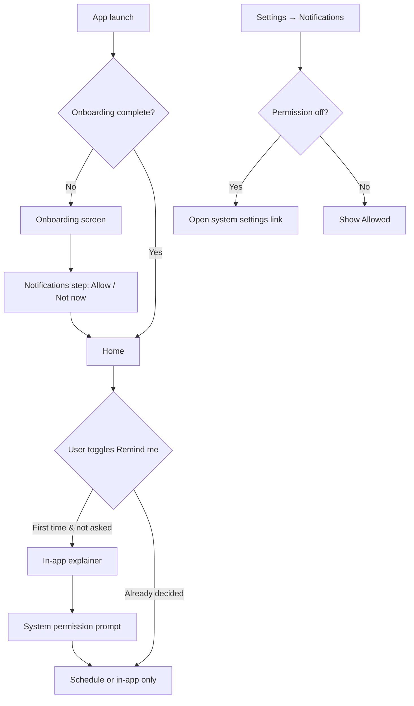

# PRD: Reminder Layer (v0.3)

**Status:** Approved — ready for implementation  
**Baseline:** v0.2 local persistence shipped (`main`)  
**Depends on:** SQLite (`debts`, `payments`), `expo-notifications` (~56.0.18, plugin in `app.json`)

This document captures product intent, frozen design decisions, and implementation guidance for the reminder layer. Written for an implementing agent without prior chat context.

**Related docs**

| Document | Role |
|----------|------|
| [prd.md](./prd.md) | Original product vision — Phase 2 “Reminder Layer” |
| [persistence-prd.md](./persistence-prd.md) | SQLite + React Query patterns |
| [performance.md](./performance.md) | List/query performance — inbox must use `FlashList` |
| [design-brief.md](./design-brief.md) | Visual tone — calm, private, human |

**Expo version:** SDK 56 — read [Expo Notifications docs](https://docs.expo.dev/versions/v56.0.0/sdk/notifications/) before implementing.

---

## 1. Summary

Owed already stores `reminder_enabled` and `reminder_time` on debts, exposes a “Remind me” toggle on add-debt, and ships a dormant `Bell` icon on Home — but **no notifications are scheduled**, **no `reminders` table exists**, and **settings are UI placeholders**.

v0.3 delivers a **robust local reminder layer**:

- OS local notifications on due date (+ optional one-shot overdue)
- Permission flow (onboarding + contextual + settings retry)
- `reminders` table as scheduling source of truth
- Foreground reconciliation after reboot / permission changes
- In-app notification inbox with badge on Home bell (fallback when OS notifications are missed or denied)

No backend. No push. No messaging debtors. Private memory aid only.

---

## 2. Problem

Users add promised dates but still forget to follow up because:

1. The app does not schedule anything despite the “Remind me” toggle.
2. Without OS permission, there is zero fallback surface.
3. When debts are paid or dates change, nothing would cancel stale reminders (once built naïvely).
4. After OS reboot or app kill, scheduled notifications can disappear while debt data persists.

---

## 3. Goals

| # | Goal |
|---|------|
| G1 | Schedule a local notification on each debt’s **due date** at the user’s default reminder time |
| G2 | Optionally schedule **one** overdue nudge the morning after due date (global opt-in, default off) |
| G3 | Cancel/reschedule reminders when debt lifecycle changes (pay, archive, toggle off, date change) |
| G4 | Recover scheduling state on every app foreground (reconcile DB ↔ OS) |
| G5 | In-app inbox + badge so users never miss a nudge entirely |
| G6 | Persist reminder settings (`defaultReminderTime`, `overdueReminderEnabled`) across launches |

---

## 4. Non-goals (this sprint)

- “Due soon” reminders (e.g. 1 day before) — deferred to v0.4+
- Per-debt custom reminder times — global time only for v0.3
- Daily recurring overdue nagging
- Snooze, digest summaries, or rich notification actions
- Push notifications / server-side scheduling
- Automatic messages to debtors
- Edit-debt UI (schema + sync hooks should be ready; screen may land separately)
- Notification history export
- Web notifications

---

## 5. Frozen design decisions

These were agreed in a design review and should not be re-litigated without explicit product sign-off.

| Topic | Decision |
|-------|----------|
| **Scope** | MVP + resilience: due + one-shot overdue, lifecycle sync, permission UX, foreground reconciliation |
| **Due trigger** | `due_date` at `defaultReminderTime` when `reminder_enabled = 1` and debt is unpaid, not archived |
| **Overdue trigger** | Single notification on **day after** `due_date` at same time, only if global `overdueReminderEnabled` and debt still unpaid |
| **Overdue opt-in** | Global Settings toggle, **default off** — not per-debt |
| **Persistence** | `reminders` table is source of truth; stores Expo `notification_id` |
| **In-app inbox** | Same `reminders` rows; `status = sent` appears in inbox |
| **Badge** | Home header `Bell` — count of `sent` rows with `read_at IS NULL` |
| **Read behavior** | Opening inbox sets `read_at` on **all** visible `sent` rows (badge clears immediately) |
| **Reminder time** | Global only via Settings; `debts.reminder_time` unused in v0.3 (column kept for future) |
| **Permissions** | (1) Onboarding step, (2) contextual on first “Remind me”, (3) Settings shows real status + link to system settings |
| **If permission denied** | In-app inbox still works; `reminder_enabled` stays on; skip OS scheduling |
| **Reconciliation** | Run on **every app foreground** |
| **OS tap** | Deep link to debt detail (`/debt/[id]`) |

---

## 6. User stories

### Schedule due-date reminder

As a user, when I enable “Remind me” on a debt, I want a notification on the promised date so I remember to follow up.

**Acceptance**

- Toggle on add-debt persists `reminder_enabled = 1`
- Due reminder row created in `reminders` with `type = 'due'`, `status = 'scheduled'`
- OS notification scheduled at `due_date` + `defaultReminderTime` (local timezone)
- Copy: `"{Name} promised to pay {amount} today."` (use remaining balance at fire time for in-app; at schedule time for OS body is acceptable)

### Optional overdue nudge

As a user, I want a single gentle reminder after someone misses a date — but only if I opt in globally.

**Acceptance**

- Settings → “Overdue reminders” toggle, default **off**
- When on, eligible debts with `reminder_enabled` also get `type = 'overdue'` row at `due_date + 1 day` same time
- Only one overdue notification per debt (not daily)

### In-app fallback

As a user, if I miss the OS banner, I want to see what fired inside the app.

**Acceptance**

- Home `Bell` shows unread badge count
- Tap → notifications inbox screen (modal or stack push)
- List `sent` reminders, newest first (`remind_at DESC`)
- Opening inbox marks all listed items read (`read_at = now`)
- Tap row → debt detail

### Lifecycle integrity

As a user, I don’t want stale reminders for paid or removed debts.

**Acceptance**

| Event | Behavior |
|-------|----------|
| Full payment / mark paid | Cancel all `scheduled` reminders for debt; cancel OS notifications |
| Partial payment | No change to schedule (due date unchanged) |
| Archive debt | Cancel all `scheduled` reminders |
| `reminder_enabled` → off | Cancel `scheduled`; do not delete `sent` history |
| Due date changed (future edit) | Cancel + rebuild `scheduled` rows |
| Global time changed | Reschedule all active `scheduled` reminders |
| Global overdue toggle on | Create missing `overdue` rows for eligible debts |
| Global overdue toggle off | Cancel `scheduled` `overdue` rows only |

### Permission & onboarding

As a user, I want to understand why the app needs notifications before iOS/Android asks.

**Acceptance**

- Onboarding: optional step — “Get a nudge on promised dates” with **Allow** / **Not now**
- First “Remind me” toggle (if not already granted/denied): short explainer → system prompt
- Settings → Notifications: live status (`Allowed` / `Off` / `Provisional`) + **Open Settings** when off
- Never block the remind toggle when permission denied

### Recovery

As a user, I expect reminders to still work after restarting my phone.

**Acceptance**

- On foreground: reconcile algorithm (§9) runs
- Uninstall + reinstall wipes SQLite — acceptable; no cloud recovery in v0.3

---

## 7. Data model

### 7.1 Migration `002-reminders`

```sql
CREATE TABLE reminders (
  id TEXT PRIMARY KEY NOT NULL,
  debt_id TEXT NOT NULL REFERENCES debts(id) ON DELETE CASCADE,
  type TEXT NOT NULL CHECK (type IN ('due', 'overdue')),
  remind_at TEXT NOT NULL,          -- ISO 8601 local instant
  status TEXT NOT NULL CHECK (status IN ('scheduled', 'sent', 'cancelled')),
  notification_id TEXT,             -- Expo schedule identifier
  read_at TEXT,                     -- NULL = unread in inbox (only meaningful when status = sent)
  created_at TEXT NOT NULL,
  updated_at TEXT NOT NULL
);

CREATE UNIQUE INDEX idx_reminders_debt_type_active
  ON reminders(debt_id, type)
  WHERE status = 'scheduled';

CREATE INDEX idx_reminders_status_remind_at ON reminders(status, remind_at DESC);
CREATE INDEX idx_reminders_unread ON reminders(status, read_at) WHERE status = 'sent';
```

**Notes**

- At most one `scheduled` row per `(debt_id, type)`.
- `read_at` only applies to `sent` rows shown in inbox.
- `notification_id` nullable when permission denied or scheduling failed (reconciliation retries).

### 7.2 Settings (AsyncStorage)

Extend `storageKeys.settings` JSON (or dedicated keys):

```ts
type PersistedReminderSettings = {
  defaultReminderTime: string;       // "HH:mm" 24h, default "09:00"
  overdueReminderEnabled: boolean;   // default false
  notificationsPermissionAsked: boolean; // avoid re-prompting explainer
};
```

Hydrate into `useSettingsStore` on launch (mirror `hydrateOnboardingState` pattern).

### 7.3 TypeScript types

Update `src/types/index.ts` `Reminder`:

```ts
export type ReminderType = "due" | "overdue";

export interface Reminder {
  id: string;
  debtId: string;
  type: ReminderType;
  remindAt: string;
  status: ReminderStatus;
  notificationId?: string;
  readAt?: string;
  createdAt: string;
  updatedAt: string;
}
```

---

## 8. Scheduling rules

### 8.1 Eligibility

A debt is **reminder-eligible** when:

- `reminder_enabled = 1`
- `archived_at IS NULL`
- `remaining balance > 0` (SQL aggregate, not JS over payments)
- `due_date` is valid

### 8.2 Computing `remind_at`

```
dueRemindAt   = due_date at defaultReminderTime (local)
overdueRemindAt = (due_date + 1 calendar day) at defaultReminderTime
```

- If computed `remind_at <= now` at schedule time: do **not** create `scheduled` row; if the instant passed recently, mark `sent` immediately (feeds inbox).
- Overdue row created only when `overdueReminderEnabled === true`.

### 8.3 Notification content

| Type | Title | Body |
|------|-------|------|
| `due` | Promised today | `{Name} promised to pay {formatCurrency(remaining)} today.` |
| `overdue` | Overdue | `{Name} was due yesterday — {formatCurrency(remaining)} still outstanding.` |

Tone: calm, factual. No shame language.

### 8.4 Expo scheduling

- Use `scheduleNotificationAsync` with `trigger: { type: 'date', date: remindAt }` (or channel equivalent on Android).
- Store returned identifier in `notification_id`.
- Include `data: { debtId, reminderId, type }` for tap handling.
- Android: ensure notification channel created on init (`owed-reminders`, default importance).

---

## 9. Reconciliation (every foreground)

Run in `src/app/_layout.tsx` after DB ready + on `AppState` → `active`. Single orchestrator: `reconcileReminders()`.

```
1. FIRE MISSED
   For each reminder WHERE status = 'scheduled' AND remind_at <= now:
     → set status = 'sent', updated_at = now
     → cancel OS notification if notification_id present

2. CANCEL STALE
   For each scheduled reminder whose debt is ineligible (paid, archived, reminder off):
     → status = 'cancelled', cancel OS notification

3. CANCEL ORPHAN OVERDUE
   If global overdueReminderEnabled = false:
     → cancel scheduled overdue rows

4. REBUILD MISSING
   For each eligible debt:
     → ensure scheduled 'due' row exists (create if missing)
     → ensure scheduled 'overdue' row exists if global on (create if missing)

5. SYNC OS
   If permission granted:
     For each scheduled row where notification_id is null or not in getAllScheduledNotificationsAsync():
       → schedule OS notification, persist notification_id
   If permission denied:
     → skip step 5; steps 1–4 still run (in-app inbox works)
```

**Performance:** batch debt eligibility via `listSummaries()` or a dedicated SQL query — do not load full payment arrays per debt.

---

## 10. Permission flow



- Track `notificationsPermissionAsked` after first explainer shown.
- Onboarding “Not now” does not set `notificationsPermissionAsked` for the contextual add-debt path.

---

## 11. Architecture

### 11.1 Module layout

```
src/features/reminders/
  lib/
    reminder-scheduler.ts      # pure schedule/cancel helpers (dates, copy)
    reconcile-reminders.ts     # foreground sync algorithm
    notification-permissions.ts
    reminder-storage.ts        # settings hydrate/persist
  repositories/
    reminder-repository.ts     # CRUD + inbox queries
  hooks/
    use-reminders-inbox.ts
    use-unread-reminder-count.ts
    query-keys.ts
  screens/
    notifications-inbox-screen.tsx
  components/
    notification-row.tsx
    bell-badge-button.tsx
```

### 11.2 Integration points

| Location | Change |
|----------|--------|
| `use-add-debt.ts` | After create → `syncRemindersForDebt(debtId)` |
| `use-record-payment.ts` | After payment → if paid, `cancelRemindersForDebt(debtId)` |
| `_layout.tsx` | Hydrate reminder settings; register notification handler; run reconcile on foreground |
| `onboarding-screen.tsx` | Add notifications step |
| `add-debt-screen.tsx` | Permission explainer on first remind toggle |
| `home-screen.tsx` | Wire `Bell` → inbox with badge |
| `settings-screen.tsx` | Real reminder time picker, overdue toggle, permission status |
| `debt-repository.ts` | Future `update` / `archive` → call reminder sync |

### 11.3 State / queries

- `staleTime: Infinity` for inbox + unread count queries (local SQLite).
- Invalidate unread count + inbox on: reconcile complete, inbox open (mark read), new `sent` rows.
- Prefetch unread count in `_layout.tsx` alongside debts (optional but consistent with performance guidelines).

### 11.4 Inbox UI

- **FlashList** for notification rows (performance guideline).
- Empty state: “No reminders yet” — calm copy.
- Route: `src/app/notifications.tsx` (modal) or stack screen.

---

## 12. Delivery plan

**One PR, staged commits.** All work lands on a single feature branch (e.g. `feature/reminders`). Each stage is one commit — you review after each commit before the next stage begins. Every commit must leave the app **buildable and runnable** on the branch.

| Stage | Commit scope | Review focus |
|-------|--------------|--------------|
| **1 — Foundation** | Migration `002-reminders`, repository, types, scheduler helpers, settings persist/hydrate | Schema, repo API, settings load on launch |
| **2 — OS notifications** | `expo-notifications` init, permissions module, schedule/cancel, tap → debt detail | Permission API, OS scheduling, deep link |
| **3 — Lifecycle** | Hook `use-add-debt` + `use-record-payment`; `syncRemindersForDebt` / `cancelRemindersForDebt` | Reminders created/cancelled on create & pay |
| **4 — Reconciliation** | `reconcileReminders` + `AppState` foreground wiring in `_layout.tsx` | Missed-fire, stale cancel, OS gap resync |
| **5 — In-app inbox** | Inbox screen, badge on Home bell, mark-all-read on open | Badge count, inbox UX, FlashList |
| **6 — Settings + onboarding** | Time picker, overdue toggle, onboarding notifications step, Settings permission row | End-to-end permission flow, global settings |

**Workflow**

1. Open PR early (draft) after stage 1 — scope is the full reminder layer, not per-stage PRs.
2. Implement one stage → commit → pause for your review.
3. Commit messages name the stage, e.g. `reminders: stage 2 — OS notifications`.
4. Do not squash until merge unless you prefer a single commit on `main`.
5. Stages 1–4 deliver OS reminders; stage 5 adds the in-app fallback; stage 6 completes settings/onboarding.

**Merge gate:** full manual test plan (§13) passes on the branch after stage 6.

---

## 13. Manual test plan

Use Settings → Developer → Seed sample data (dev builds).

| # | Scenario | Expected |
|---|----------|----------|
| T1 | Add debt, remind on, permission granted, due date tomorrow | 1 `scheduled` due row; appears in `getAllScheduledNotificationsAsync` |
| T2 | Toggle global overdue on | 2nd `scheduled` overdue row at due+1 |
| T3 | Mark debt paid | All `scheduled` → `cancelled`; OS notifications gone |
| T4 | Deny permission, remind on | `scheduled` rows exist; no OS entries; foreground still marks `sent` when due |
| T5 | Miss OS notification, open app after `remind_at` | Reconcile marks `sent`; badge increments; inbox shows item |
| T6 | Open inbox | Badge clears; all items have `read_at` |
| T7 | Kill app, change system date (dev), reopen | Reconcile fires missed reminders |
| T8 | Change default time in Settings | All `scheduled` rescheduled to new time |
| T9 | Tap OS notification | Opens debt detail |
| T10 | Seed 50+ debts with reminders, scroll inbox | Smooth scroll (FlashList) |

---

## 14. Risks

| Risk | Mitigation |
|------|------------|
| iOS permission denial is permanent until Settings | Settings retry row + in-app inbox |
| Expo notification IDs invalidated on OS update | Foreground reconciliation reschedules gaps |
| Timezone / DST edge cases | Use local date helpers; test around DST if possible |
| Duplicate notifications | Unique partial index on `(debt_id, type)` where scheduled |
| Reconcile runs too often | Cheap SQL + early exit if no eligible debts; acceptable at v0.3 scale |

---

## 15. Success metrics

- % debts created with `reminder_enabled`
- Notification permission grant rate (onboarding vs contextual)
- % `sent` reminders with `read_at` within 24h (inbox engagement)
- % debts marked paid within 7 days of due reminder (proxy for usefulness)

---

## 16. Agent checklist

- [ ] Read [performance.md](./performance.md) — inbox uses FlashList; use `listSummaries()` for eligibility batches
- [ ] Read Expo Notifications v56 docs for `scheduleNotificationAsync`, permissions, and response listener
- [ ] Migration version 2 registered in migration runner
- [ ] All reminder IDs via `createId()` from `src/lib/id.ts`
- [ ] `staleTime: Infinity` on reminder queries; invalidate in mutations + reconcile
- [ ] Do not send notifications to debtors — local device only
- [ ] Verify with seeded data: Home badge, inbox, due/overdue copy, pay → cancel

---

## 17. Reference: grilling decision log

| # | Question | Answer |
|---|----------|--------|
| 1 | Scope | B — MVP + resilience |
| 2 | Overdue frequency | A — one-shot only |
| 3 | Overdue opt-in | B — global, default off |
| 4 | Data model | A — `reminders` table + `notification_id` |
| 5 | In-app inbox | A + A1 — extend rows; mark all read on inbox open |
| 6 | Reminder time | A — global only |
| 7 | Permissions | Onboarding + contextual first remind + settings retry |
| 8 | Reconciliation | A — every foreground; OS tap → debt detail |
